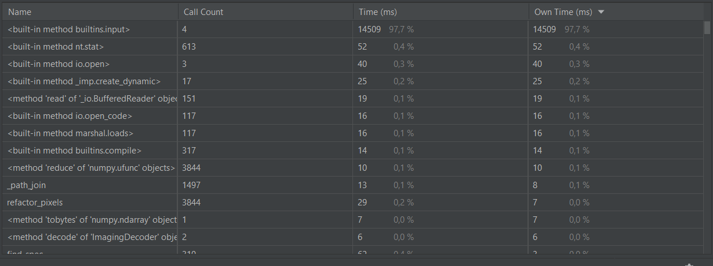
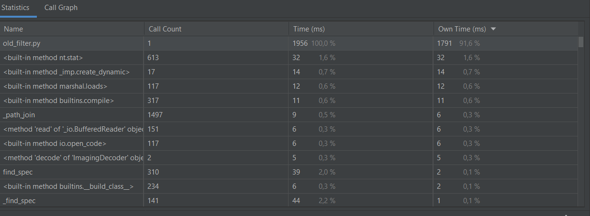
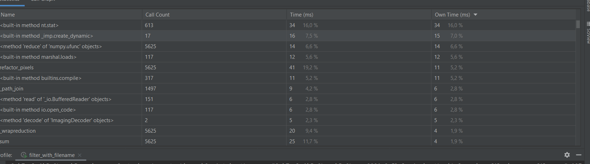
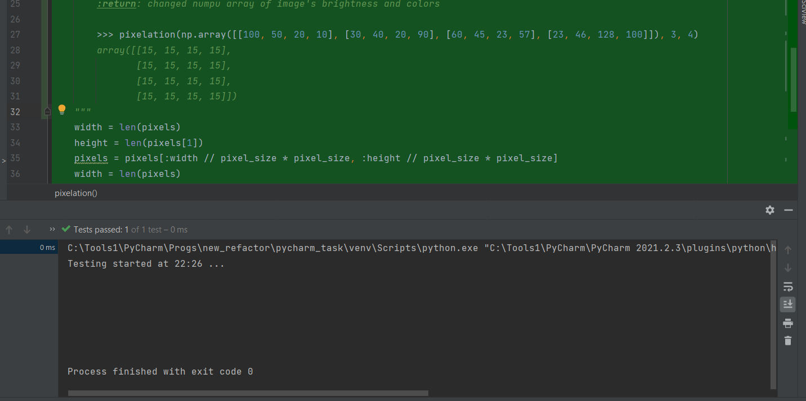

Время работы нового фильтра с пользовательским вводом filter.py

Время работы старого фильтра old_filter.py

Время работы нового фильтра без пользовательского ввода filter_with_filename.py 

уменьшение времени работы файла связано с тем, что вместо цикличного изменения данных о пикселях фотографии производятся матричные преобразования выполнияющиезя за O((log(n))^2)

Фото до

Фото после

тестирование работы метода по свертке массива

